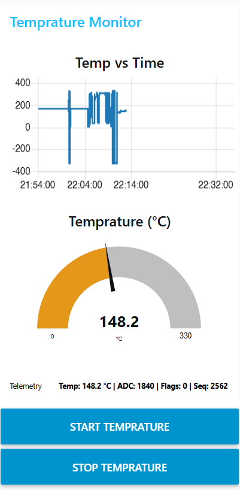

# Temperature Telemetry Pipeline

A complete **edge → gateway → dashboard** telemetry system:

- **STM32 BluePill (Edge)** samples an LM35 using **ADC + DMA**, processes data in a **ping-pong buffer**, computes an **average**, smooths it with an **IIR filter**, packetizes it into a **binary framed protocol**, and transmits using **USART1 TX DMA**.
- **ESP32 (Gateway)** receives the binary frames over **UART + DMA**, validates and parses them, then publishes decoded values to **MQTT**.
- **Node-RED (Dashboard)** subscribes to MQTT and renders live temperature metrics (charts + numeric indicators).

---

## Repository Structure

```text
temperature-telemetry-pipeline/
├── README.md
├── docs/
│   ├── protocol.md        # Frame layout, CRC, examples
│   ├── wiring.md          # Pin mappings (STM32 ↔ ESP32 ↔ LM35)
│   └── images/
├── stm32-bluepill-fw/     # STM32CubeIDE project
├── esp32-fw/              # ESP-IDF firmware
└── nodered/               # Node-RED flow export
```

## End-to-End Data Flow (What Actually Happens)

## 1) ADC sampling using TIM3 trigger + ADC DMA
- **TIM3** generates periodic triggers (`TRGO_UPDATE`).
- **ADC1** runs one conversion per trigger (`ADC_CHANNEL_0`).
- **DMA1_Channel1** writes ADC samples into `adc_buf[]`:


## 2) Ping-pong buffering using half/full DMA callbacks

The 200-sample DMA buffer is treated as two halves:

- First half: adc_buf[0 .. 99]

- Second half: adc_buf[100 .. 199]

This is effectively a ping-pong scheme:

- While DMA fills half B, CPU processes half A

- While DMA fills half A, CPU processes half B

- No samples are missed, and CPU work is spread out.


## 3) Averaging each half-buffer (noise reduction)

In the main loop, when either flag is set:
- CPU computes the average of that half-buffer.

This turns 100 raw ADC samples into one averaged sample per half-buffer update.

## 4) IIR filtering on the averaged sample (smoothing)

After averaging, you run an IIR low-pass:

- f[n]=87​f[n−1]+81​x[n]

That means each new update nudges the filtered value ~12.5% toward the new average.


## 5) Convert filtered ADC counts to temperature (LM35, °C × 100)

temp_c_x100 is computed from the filtered ADC counts.
conversion assumes:
- Vref = 3300 mV
- 12-bit ADC: 0..4095
- LM35: 10 mV / °C


## 6) Packetize into a binary frame (with seq + timestamp + CRC)

When an update happens, STM32 builds a framed packet:
- Header (12 bytes)
- magic (0xAA55)
- version
- msg_type
- payload_len
- seq
- timestamp_ms
- Payload (5 bytes)
- filt_adc (uint16)
- temp_c_x100 (int16)
- flags (uint8)
- CRC16 (2 bytes)
- CRC-16/CCITT-FALSE over header+payload


## 7) USART1 transmit using DMA (non-blocking)

Frames are sent via HAL_UART_Transmit_DMA() so the CPU never blocks waiting for UART.
Ping-pong TX buffers avoid modifying memory while DMA reads.

Rules:
- If UART DMA is idle → use whichever buffer isn’t “active”.
- If UART DMA is busy → you allow one queued frame (tx_queued) using the other buffer.
- If DMA is busy and a frame is already queued → drop newest update (simple and safe).
- DMA completion callback chains queued frame automatically

When DMA finishes transmitting:
- If a queued frame exists → transmit it immediately
- Else → mark UART idle


## 8) ESP32 receives via UART + DMA, parses frames, publishes to MQTT

On the ESP32 side (ESP-IDF), the intended pipeline is:

- UART RX uses DMA internally (ESP-IDF UART driver uses ring buffers; HW uses DMA/FIFO depending on target).
- Scan incoming bytes for magic = 0xAA55.
- Read fixed header (12 bytes), then payload_len, then CRC.
- Compute CRC-16/CCITT-FALSE over header+payload and compare.

If valid:

- Extract filt_adc, temp_c_x100, flags, seq, timestamp.


## MQTT command + telemetry behavior

ESP32 subscribes to a cmd topic and listens for these commands:
-TEMP → start publishing temperature telemetry
-STOP → stop publishing temperature telemetry

When the ESP32 receives TEMP, it begins publishing the following telemetry topics:

MQTT publish mapping:
- telemetry/temperature/c_x100 → integer
- telemetry/temperature/c → float string (optional)
- telemetry/adc/filt → integer
- telemetry/seq → integer
- telemetry/uptime_ms → integer

When the ESP32 receives STOP, it stops publishing the temperature telemetry.


## 9) Node-RED subscribes and visualizes

Node-RED connects to the same MQTT broker and:
- subscribes to the telemetry topics
- drives a dashboard chart + gauges + text fields
  


## Documentation

- 📄 [Telemetry Protocol](docs/PROTOCOL.md)
- 🔌 [Hardware Wiring](docs/WIRING.md)


